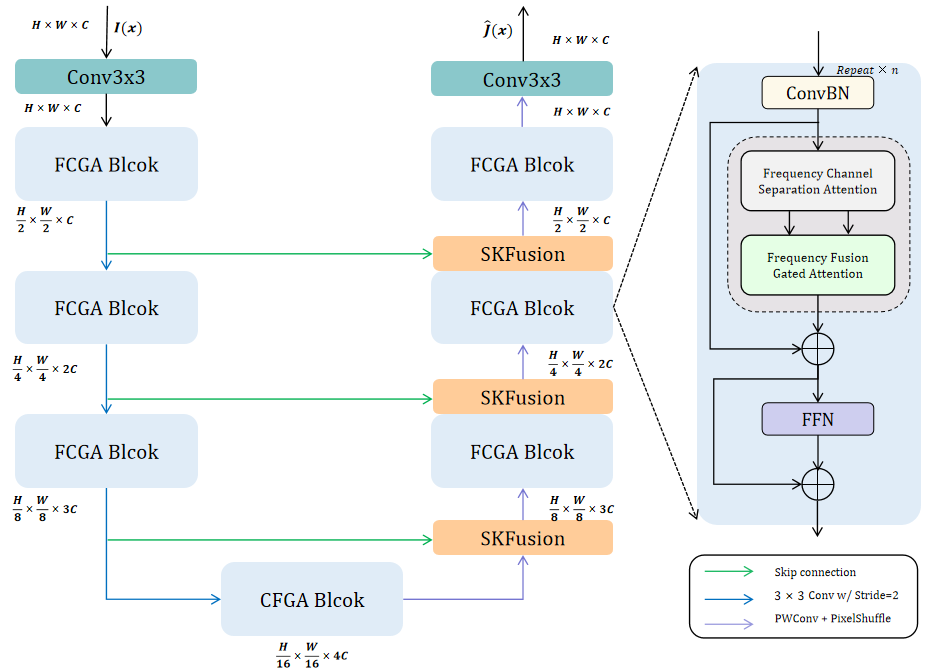

# Image Restoration Using Frequency Channel Gated Attention Under Severe Weather Conditions

> **Abstract:** 
Restoring images under adverse weather conditions is a formidable challenge in computer vision. 
> Many methods have achieved advanced performance on restoring images degraded by adverse weather conditions such as haze, rain, and snow. 
> However, most of these methods are designed to address a particular type of degradation. In this paper, we propose a lightweight and efficient Frequency Channel-Gated Attention network (FCGA-uNet) for the restoration of all adverse weather-degraded images. FCGA-uNet employs a compact uNet-shaped architecture that allows long-range interactions between low-level and high-level features. 
> Specifically, we propose a Frequency Channel Gated Attention Block (FCGA Block), which comprises two crucial components: a Frequency Channel Separation Attention (FCSA) module and a Frequency Fusion Gated Attention (FFGA) module. 
> Firstly, we employ the Frequency Channel Separation Attention (FCSA) module to decompose the high and low frequency components, 
> which can capture both local details from high frequency and global structures from low frequency. 
> Next, by the Frequency Fusion Gated Attention (FFGA) module to focus on the efficient spatial blending of high frequency and low-frequency visual cues, 
> thus preserving the restoration details from different frequency components. 
> Extensive experiments demonstrate that FCGA-uNet achieves state-of-the-art performance on various restoration tasks under adverse weather conditions, 
> including image dehazing, deraining, desnowing and multi-weather restoration.

### Network Architecture



### News

- **Aug 11, 2023:** All codes, pre-trained models, and training logs are released, including models in ablation studies.

## Getting started

### Install

We test the code on PyTorch 1.12.1 + CUDA 11.3 + cuDNN 8.3.2.

1. Create a new conda environment
```
conda create -n your_name python=3.9
conda activate your_name
```

2. Install dependencies
```
conda install pytorch=1.12.1 torchvision torchaudio cudatoolkit=11.3 -c pytorch
```

## Training and Evaluation

### Train

You can modify the training settings for each experiment in the `configs` folder.
Then run the following script to train the model:

SEE train.py

